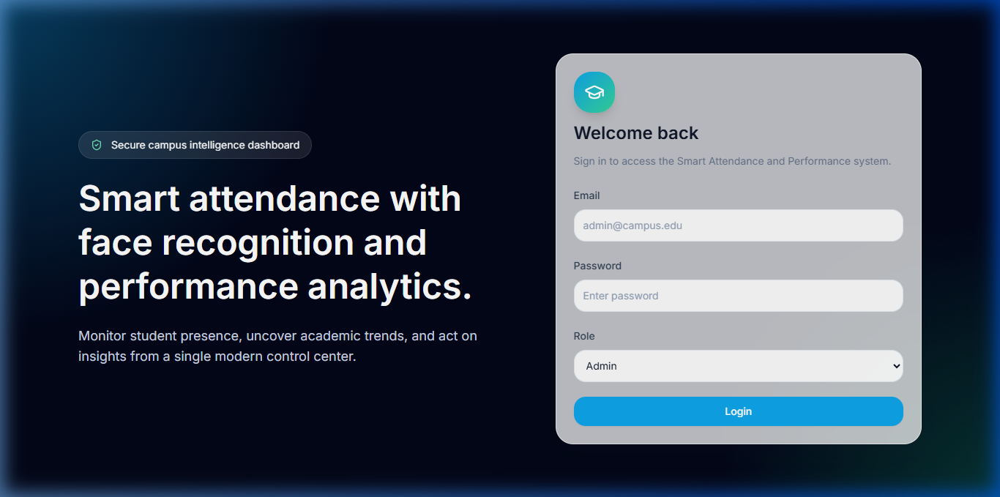
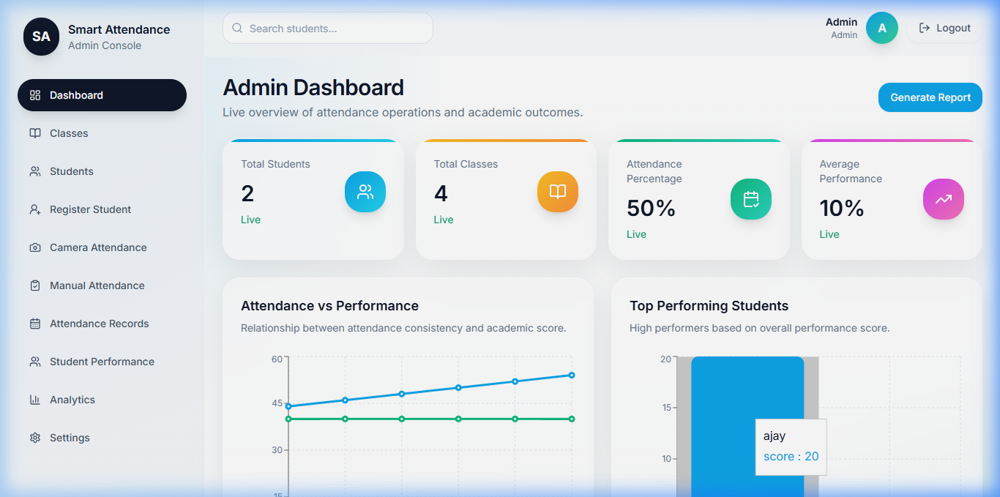
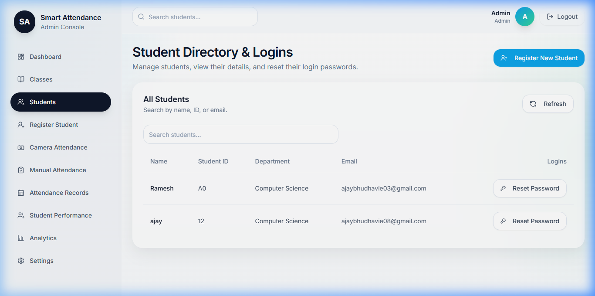
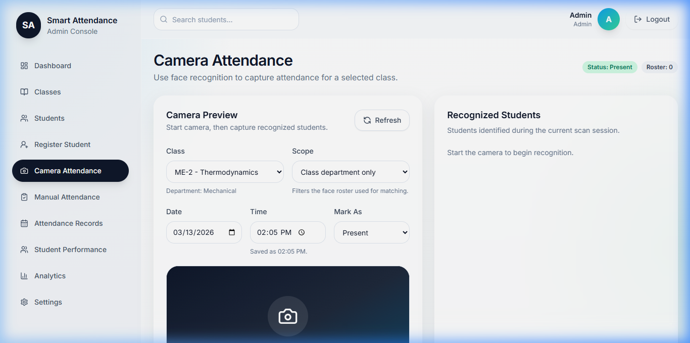
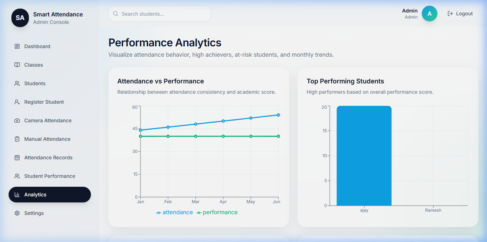

# Smart Attendance System - Project Documentation

## 1. Project Overview
The **Smart Attendance System** is a modern, full-stack web application designed to automate student attendance tracking using Artificial Intelligence. By leveraging facial recognition technology, the system eliminates traditional manual methods, providing a secure, efficient, and data-driven approach to classroom management.

---

## 2. Key Features
- **AI Face Recognition**: Automated attendance capture using `face-api.js` for real-time student identification.
- **Admin Dashboard**: A comprehensive control center with live statistics and status updates.
- **Student Management**: Full-featured directory to register students, manage records, and reset credentials.
- **Performance Analytics**: Visualized correlation between physical attendance and academic results.
- **Real-time Statistics**: Instant tracking of attendance percentages and top-performing students.
- **Secure Authentication**: Role-based access control (Admin/Student) with JWT-based security.

---

## 3. Technology Stack

### Frontend
- **Framework**: React 18 (Vite-powered)
- **Styling**: Tailwind CSS
- **AI/ML**: Face-api.js & TensorFlow.js
- **Charts**: Recharts
- **Icons**: Lucide-react

### Backend
- **Runtime**: Node.js
- **Framework**: Express.js
- **Database**: SQLite (via `sql.js` & `sqlite3`)
- **Security**: Bcrypt.js & JSON Web Tokens (JWT)
- **Validation**: Zod

---

## 4. Visual Walkthrough

### 4.1 Landing & Login
The application features a sleek, dark-themed landing page. Administrators can log in through a secure portal to access the management console.



### 4.2 Administrative Dashboard
The dashboard provides a high-level overview of the campus operations, including total students, active classes, and average attendance performance.



### 4.3 Student Directory
Administrators can manage the entire student body, search by name or ID, and handle administrative tasks like password resets.



### 4.4 Camera-Based Attendance
The core feature of the system. It uses the device's camera to recognize students' faces and automatically marks them present for the selected class session.



### 4.5 Performance Analytics
This module provides deep insights into student behavior, allowing educators to identify at-risk students and celebrate high achievers.



---

## 5. System Architecture
The project follows a decoupled client-server architecture:
- **Client**: Handles the UI and heavy-lifting AI processing (Face Recognition) locally in the browser to ensure low-latency performance.
- **Server**: Manages data persistence, authentication, and administrative API endpoints.
- **Database**: A portable SQLite database stores student records, logs, and performance metrics.

---

## 6. Setup & Installation

### Prerequisites
- Node.js (v18 or higher)
- npm or yarn

### Steps
1. **Clone the repository**:
   ```bash
   git clone <repository-url>
   cd smart-attendance-system
   ```

2. **Install Dependencies**:
   ```bash
   npm install
   cd server && npm install
   ```

3. **Configure Environment**:
   - Create a `.env` file in the `server/` directory.
   - Set `PORT=8080` and `JWT_SECRET=your_secret`.

4. **Run the Application**:
   - Start Backend: `npm run dev:server` (from root)
   - Start Frontend: `npm run dev` (from root)

5. **Access**:
   - Open `http://localhost:5173` in your browser.

---

## 7. Future Enhancements
- **Multi-Camera Support**: Distributed attendance across large lecture halls.
- **Mobile Application**: Dedicated app for students to track their own attendance and performance.
- **Automatic Notifications**: Email/SMS alerts for low attendance or high performance.
- **Cloud Integration**: Migration to PostgreSQL for larger scale deployments.
